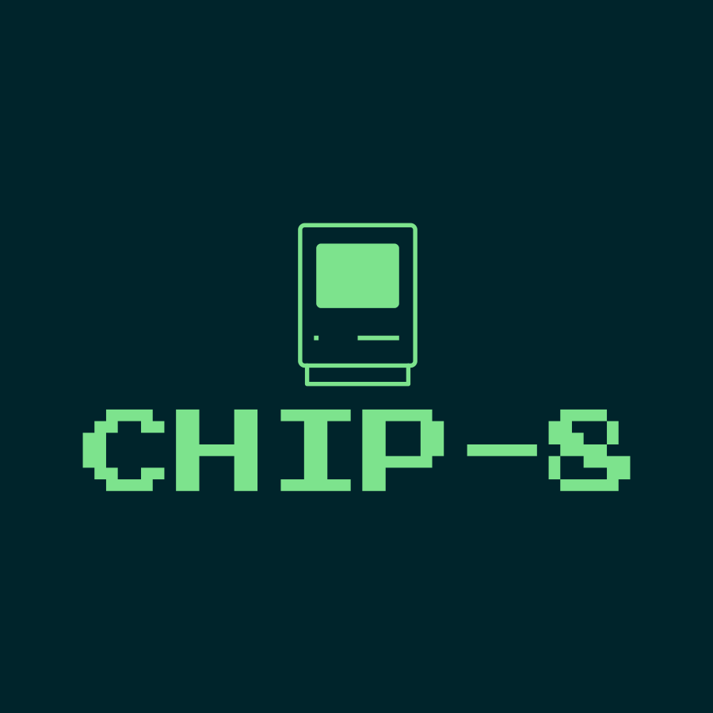

# Kotlin CHIP-8
A CHIP-8 interpreter written in Kotlin. [CHIP 8](https://en.wikipedia.org/wiki/CHIP-8) is an interpreted language designed in the 1970's.

This project contains a disassembler, instruction decoder and interpreter. It is still a work in progress.
